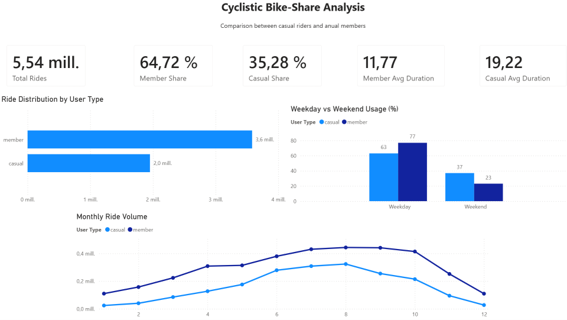
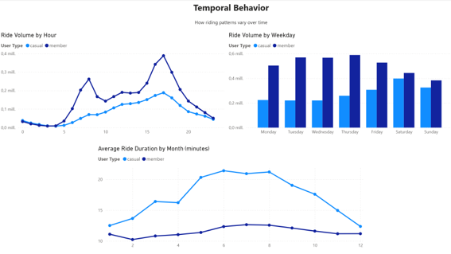
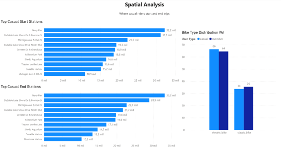
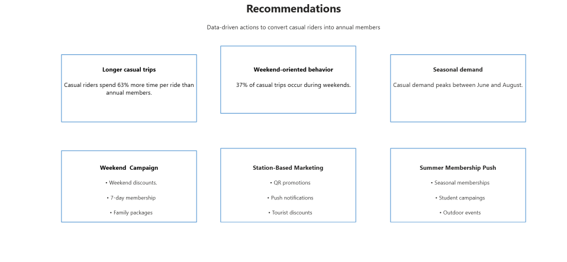

# cyclistic-bike-share-analisys
Cyclistic bike-share case study using SQL, BigQuery and Power BI

## Project Overview
This project analyzes more than 5.5 million Cyclistic bike-share trips to identify behavioral differences between casual riders and annual members.

## Business Task
Cyclistic wants to increase the number of annual memberships. The objective of this analysis is to identify usage patterns that can support data-driven marketing strategies.

## Tools Used
- SQL
- Google BigQuery
- Power BI
- DAX

## Dataset
The analysis uses 12 months of historical Cyclistic/Divvy trip data.

## Data Cleaning
The original dataset contained 5,697,455 records. After cleaning, 5,535,677 valid rides remained.

## Dashboard

## Key Findings
- Annual members generated 64.72% of all rides.
- Casual riders spent approximately 63% more time per trip.
- Casual riders showed higher weekend activity.
- Casual rider demand increased significantly during summer.
- High casual rider activity was concentrated around tourist and recreational stations.

## Recommendations
- Launch weekend-focused membership campaigns.
- Promote memberships during summer months.
- Implement station-based marketing at high-casual locations.
- Highlight the value of annual memberships for longer recreational rides.

## Project Files
- `SQL/` contains SQL scripts used for cleaning and analysis.
- `PowerBI/` contains the Power BI dashboard file.
- `Report/` contains the final case study report.
- `Dashboard/` contains dashboard screenshots.
